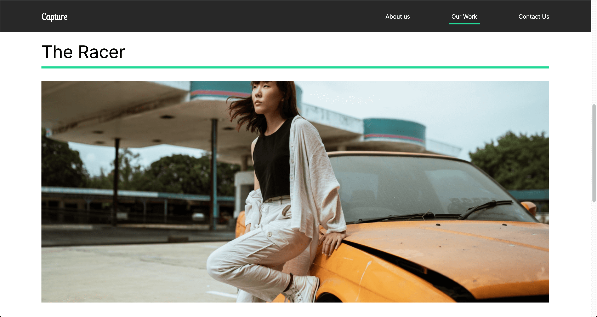

# Capture | Photography portfolio

## Demo link:
Access this app at <a href="https://capture-portfolio01.netlify.app/">
      https://capture-portfolio01.netlify.app/
    </a>

## Technologies
`react`, `styled component`, `react router dom`, `framer motion`

## Setup
- download or clone the repository
- run `npm install`
- then run `npm start` to runs the app in the development mode.
- open http://localhost:3000 to view it in the browser.

## Note
- This app is not mobile responsive.